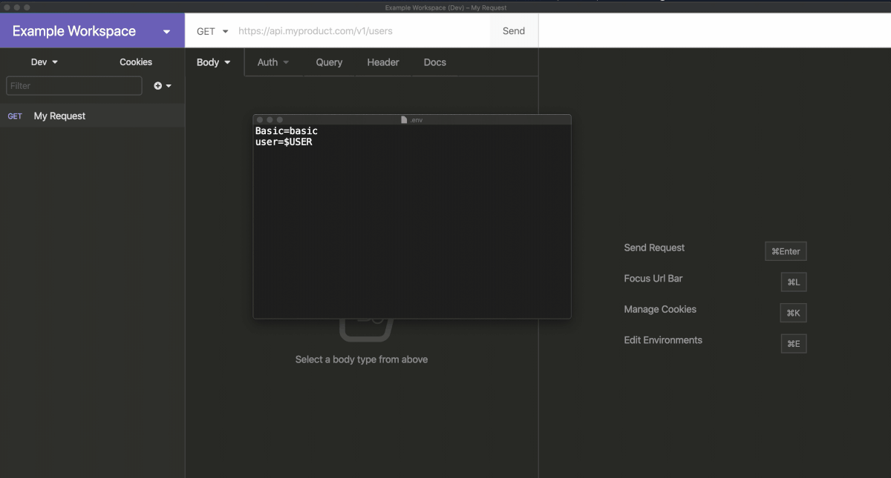

# Insomnia Plugin - json-config
 

Fetch data from a .env file.

### Installation:

- Open Insomnia options (Ctrl + , | Cmd + ,)
- Type `insomnia-plugin-json-config` on the **Plugins** tab

### Usage:
- To load JSON file via system dialog

- To add JSON via environment variable

- Multiple users can use relative path, which resolves to their specific location

- Add Environment variables inside your JSON file, it will be expanded automatically

